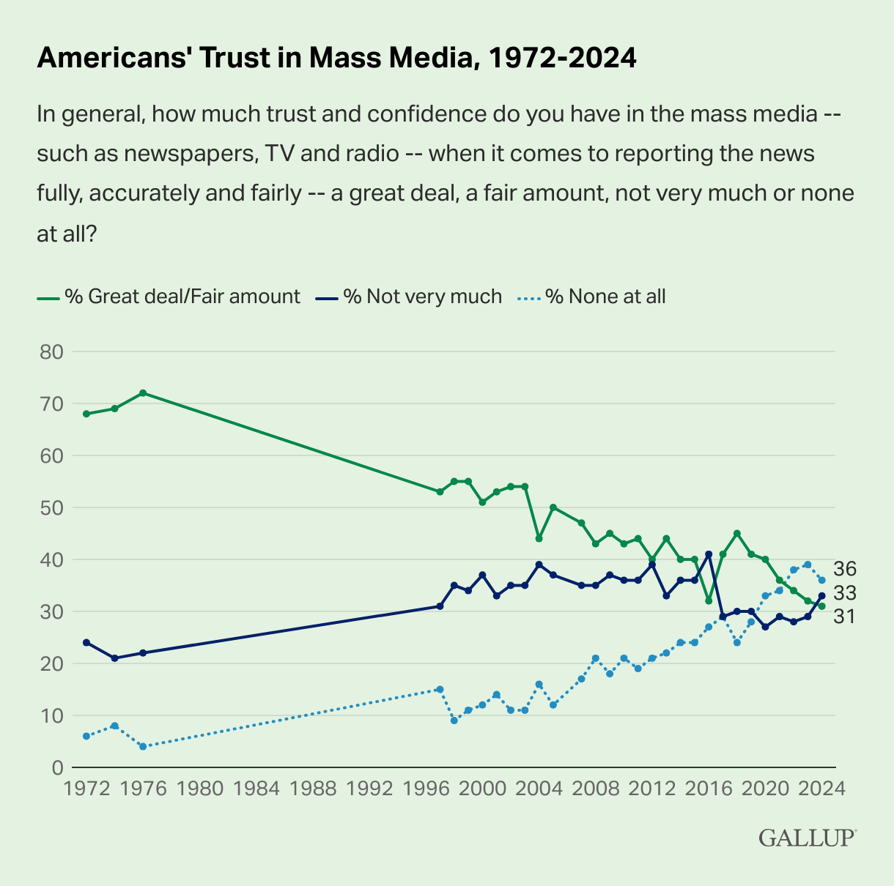
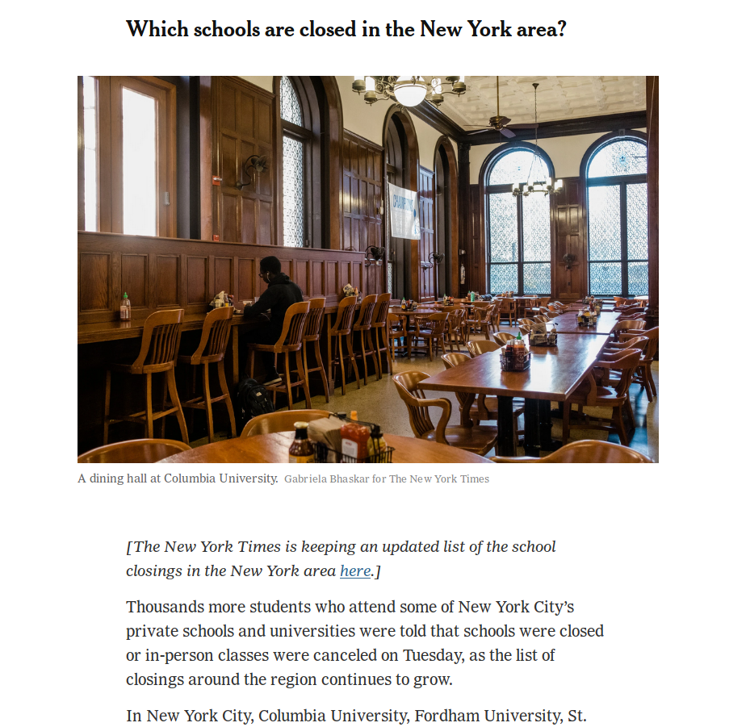
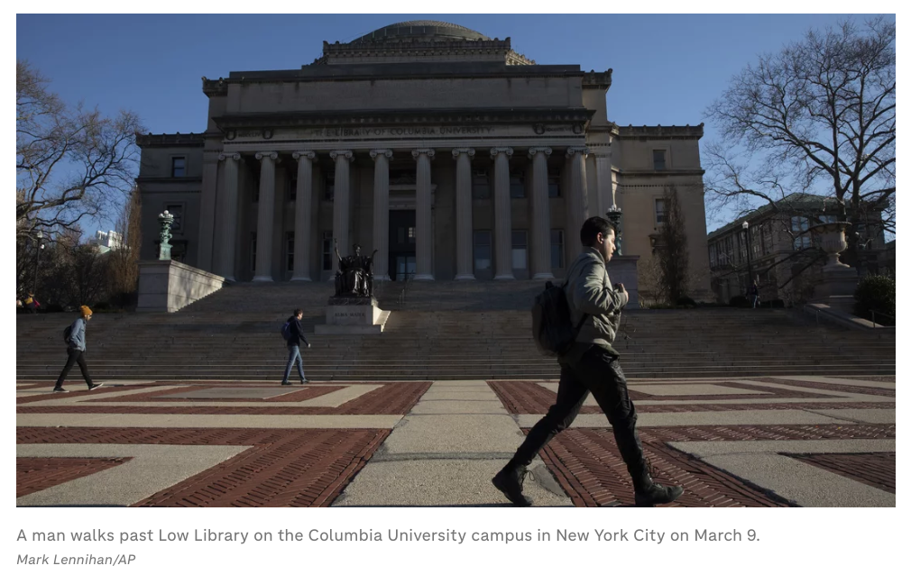
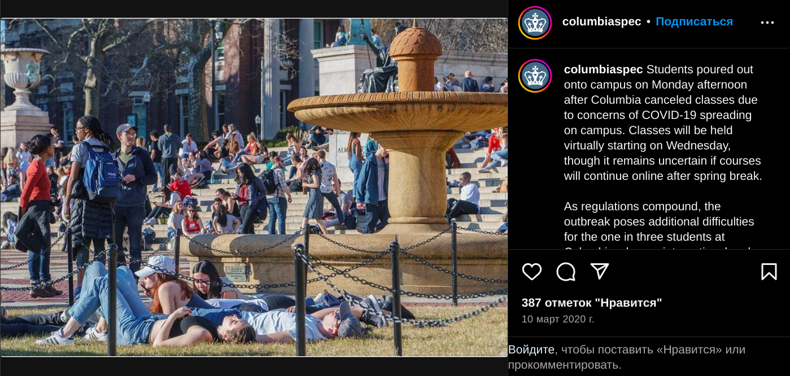

# Trust in Media

2024-11-09

According to whatever metrics, the public's trust in media pretty low in the US. See this figure [from Gallup](https://news.gallup.com/poll/651977/americans-trust-media-remains-trend-low.aspx):

<!-- gallup-media-trust.png -->

Which bin would you put yourself in? I would put myself under "Not very much." Let's examine why that is. I think there are a few things that have reduced my trust in the media:

- [My perception of media bias](#bias)
- [The media being wrong about something concerning me](#govt)
- [Subtle messaging in visual media ](#visual)

Note: when I say "the media" here, I mean what some refer to as "traditional media" or "legacy media." Basically the large corporate newspapers and cable news. I don't mean independent media, social media, etc.

## Bias in reporting

According to whatever surveys, many or most Americans think the media is biased. Some think it biased to the political left, and some think it biased to the political right. If you define the center as the "average" or "moderate" US voter, then based on my perception I would say the media is biased to the left. (But, for exmaple, they may at the same time be biased to the "right" of California politics). Of course, the left-right axis is not (and should not be) the only dimension of political belief, and maybe the media have a right-leaning bias on some issues.

Since the election has just happened, the top-of-mind example of media bias for me is election-related. What I've noticed is that, nowadays, when a friend tells me that Donald Trump said something highly questionable, I don't believe it unless I see the full context. Of course, I trust my friends, so why is that?

Given that I trust my friends, this would be the ideal communication path:

1. Trump says something
2. My friend hears him say it
3. My friend tells me what Trump said

I do not have friends who hang out with Trump or watch him much, so this is not what happens. Instead it is more like this:

1. Trump says something
2. The media report on it
3. My friend sees the media's reports
4. My friend tells me what Trump said

(In practice, sometimes point 2 is a chain of media reports, and sometimes point 3 is a chain of people.)

Unfortunately, I have lost trust in the accurate reporting of the media. Or rather, they have lost my trust.

Let's first examine two examples of a Trump quote, and some corresponding media headlines.

- The media examples are both US and international, news and magazine and tabloid, reputable and non-reputable.
- I give the headlines because that is the public's initial impression an article, and where the article's message can be most obvious.
- I also give a headline which I think better conveys the context and what Trump seems to have meant.

You can judge for yourself how faithfully the article headlines represent what Trump means. I think the comparison between the quotes and the headlines speaks for itself.

### The bloodbath

Here is an excerpt from a Trump rally on March 16, 2024 in Dayton, Ohio.

*China now is building a couple of massive plants where they’re going to build the cars in Mexico and think, they think, that they’re going to sell those cars into the United States with no tax at the border. Let me tell you something to China, if you’re listening President Xi, and you and I are friends, but he understands the way I deal. Those big monster car manufacturing plants that you’re building in Mexico right now, and you think you’re going to get that, you’re going to not hire Americans, and you’re going to sell the cars to us? No. We’re going to put a 100% tariff on every single car that comes across the line, and you’re not going to be able to sell those cars. If I get elected. Now, if I don’t get elected, it’s going to be a bloodbath, for the whole — that’s going to be the least of it. It’s going to be a bloodbath for the country. That’ll be the least of it. But they’re not going to sell those cars.*

- [NY Times](https://www.nytimes.com/2024/03/16/us/politics/trump-speech-ohio.html){rel=“nofollow”}: Trump Says Some Migrants Are ‘Not People’ and Predicts a ‘Blood Bath’ if He Loses
- [NY Times](https://www.nytimes.com/2024/03/18/us/politics/trump-blood-bath-auto-industry.html){rel=“nofollow”}: Trump Defends His Warning of a 'Blood Bath for the Country'
- [WaPo](https://www.washingtonpost.com/video/national/trump-predicts-bloodbath-if-he-isnt-elected/2024/03/18/4d906175-864e-4050-86c1-e820388a76f6_video.html){rel=“nofollow”}: Trump predicts 'bloodbath' if he isn't elected
- [LA Times](https://www.latimes.com/world-nation/story/2024-03-16/trump-warns-of-bloodbath-if-he-loses-in-november){rel=“nofollow”}: ‘If I don’t get elected, it’s going to be a bloodbath’: Trump campaign downplays remarks
- [Politico](https://www.politico.com/news/2024/03/16/trump-bloodbath-biden-november-00147453){rel=“nofollow”}: Trump says country faces ‘bloodbath’ if Biden wins in November
- [Guardian](https://www.theguardian.com/us-news/2024/mar/17/trump-verbal-gaffes-ohio-rally-bloodbath){rel=“nofollow”}: Trump predicts ‘bloodbath’ if he loses election and claims ‘Biden beat Obama’
- [NBC](https://www.nbcnews.com/politics/donald-trump/trump-bloodbath-loses-election-2024-rcna143746){rel=“nofollow”}: Trump says there will be a 'bloodbath' if he loses the election
- [CBS](https://www.cbsnews.com/news/ohio-campaign-rally-trump-says-there-will-be-bloodbath-if-he-loses-november-election/){rel=“nofollow”}: In Ohio campaign rally, Trump says there will be a "bloodbath" if he loses November election
- ABC ([archived](https://archive.is/JP6DV){rel=“nofollow”}, [current](https://abcnews.go.com/Politics/trump-predicts-bloodbath-loses-2024-election-ramps-anti/story?id=108190653){rel=“nofollow”}): Trump says there will be 'bloodbath' if he loses 2024 election, ramps up anti-migrant rhetoric
- [AP (via NPR)](https://www.npr.org/2024/03/17/1239019225/trump-says-some-migrants-are-not-people-and-warns-of-bloodbath-if-he-loses){rel=“nofollow”}: Trump says some migrants are 'not people' and warns of 'bloodbath' if he loses
- [PBS](https://www.pbs.org/newshour/politics/trump-warns-of-bloodbath-if-he-isnt-reelected-at-ohio-rally-for-senate-candidate-moreno){rel=“nofollow”}: Trump warns of ‘bloodbath’ if he isn’t reelected at Ohio rally for Senate candidate Moreno
- [Real Clear Politics](https://www.realclearpolitics.com/video/2024/03/16/trump_if_i_dont_get_elected_its_going_to_be_a_bloodbath.html){rel=“nofollow”}: Trump: If I Don't Get Elected, "It's Going To Be A Bloodbath"
- [NY Times (Opinion)](https://www.nytimes.com/2024/03/18/opinion/donald-trump-blood-bath.html){rel=“nofollow”}: Trump's Warning of a 'Blood Bath' if He Loses
- [Rolling Stone](https://www.rollingstone.com/politics/politics-news/donald-trump-bloodbath-no-elections-ohio-rally-1234989056/){rel=“nofollow”}: Trump Says There Will Be a ‘Bloodbath’ and Elections Will End if He Isn’t Reelected
- [Raw Story](https://www.rawstory.com/trump-2667530593/){rel=“nofollow”}: Internet shreds Trump after ex-president warns of 'bloodbath' if he loses election 
- [NY Daily News](https://www.nydailynews.com/2024/03/17/donald-trumps-threat-of-bloodbath-if-joe-biden-beats-him-puts-gop-supporters-on-defensive/){rel=“nofollow”}: Donald Trump’s threat of ‘bloodbath’ if Joe Biden beats him puts GOP supporters on defensive
- [France24](https://www.france24.com/en/americas/20240317-trump-warns-of-bloodbath-if-he-loses-presidential-election){rel=“nofollow”}: Trump warns US voters of a 'bloodbath' if he loses presidential election
- [Jerusalem Post](https://www.jpost.com/american-politics/article-792302){rel=“nofollow”}: Donald Trump: 'If I don't get elected, it's going to be a bloodbath for the country!'

Good headline: [CNN](https://www.cnn.com/2024/03/16/politics/trump-bloodbath-auto-industry-election/index.html): Trump warns of ‘bloodbath’ for auto industry and country if he loses the election

### The firing squad

Here is an excerpt from an Oct. 31 campaign event. Trump is speaking to Tucker Carlson and the audience.

*I don't want to go to war. (Liz Cheney) wanted to go, she wanted to stay in Syria. I took (troops) out. She wanted to stay in Iraq. I took them out. I mean, if were up to her, we'd, we'd be in 50 different countries. And you know, number one, it's very dangerous. Number two, a lot of people get killed. And number three, I mean, it's very, very expensive.*

...

*I don’t blame (Dick Cheney) for sticking with his daughter, but his daughter is a very dumb individual, very dumb. She's a radical war hawk. Let's put her with a rifle standing there with nine barrels shooting at her, ok, let's see how she feels about it, you know, when the guns are trained on her face. You know they're all war hawks when they're sitting in Washington in a nice building, saying oh gee, we'll, let's send 10,000 troops right into the mouth of the enemy. But she's a stupid person. I used to have, I had meetings with a lot of people. She always wanted to go to war with people.*

- [NY Times](https://www.nytimes.com/2024/11/01/us/politics/trump-liz-cheney-tucker-carlson.html){rel=“nofollow”}: Trump Assails Liz Cheney and Imagines Guns ‘Shooting at Her’
- [WaPo](https://www.washingtonpost.com/politics/2024/11/01/liz-cheney-trump-guns-shooting/){rel=“nofollow”}: Trump embraces violent rhetoric, suggests Liz Cheney should have guns ‘trained on her face’
- [The Atlantic](https://www.theatlantic.com/politics/archive/2024/11/trump-liz-cheney-war/680485/){rel=“nofollow”}: Trump Suggests Training Guns on Liz Cheney’s Face
- [Politico](https://www.politico.com/news/2024/11/01/cheney-trump-firing-squad-threats-are-how-dictators-destroy-free-nations-00186707){rel=“nofollow”}: Suggesting ‘nine barrels shooting’ at Cheney, Trump reverts to violent rhetoric
- [CNN](https://www.cnn.com/2024/11/01/politics/donald-trump-liz-cheney-war-hawk-battle/index.html){rel=“nofollow”}: Trump says ‘war hawk’ Liz Cheney should be fired upon in escalation of violent rhetoric against his opponents
- [The 19th](https://19thnews.org/2024/11/trump-liz-cheney-shot/): Trump suggests Liz Cheney should be shot 
- [NY Daily News](https://www.nydailynews.com/2024/11/01/trump-threatens-liz-cheney-with-execution-firing-squad/){rel=“nofollow”}: Democrats slam Trump for saying ex-Rep. Liz Cheney should have guns ‘trained on her face’
- [NJ](https://www.nj.com/politics/2024/11/trump-is-an-old-man-getting-off-on-violent-dark-fantasy-of-a-liz-cheney-firing-squad.html){rel=“nofollow”}: Trump is an old man ’getting off’ on ‘violent, dark fantasy’ of a Liz Cheney firing squad
- [Roll Call](https://rollcall.com/2024/11/01/trump-advocates-nine-barrels-shooting-at-liz-cheney/){rel=“nofollow”}: Trump advocates ‘nine barrels shooting at’ Liz Cheney
- [Mother Jones](https://www.motherjones.com/politics/2024/11/trump-liz-cheney-guns-face/){rel=“nofollow”}: Trump Called for Placing Liz Cheney Before Guns “Trained on Her Face.” But What About “Garbage”?
- [The Daily Beast](https://www.thedailybeast.com/trump-fantasizes-about-liz-cheney-facing-the-firing-squad/){rel=“nofollow”}: Trump Fantasizes About Shooting Female Rival in the Face
- [People](https://people.com/liz-cheney-sounds-alarm-donald-trump-suggests-firing-squad-dictators-destroy-free-nations-8738139){rel=“nofollow”}: Liz Cheney Sounds Alarm After Donald Trump Suggests She Face Firing Squad: 'How Dictators Destroy Free Nations'
- [Deadline](https://deadline.com/2024/11/trump-liz-cheney-rifles-violent-rhetoric-1236164331/){rel=“nofollow”}: Liz Cheney Condemns Donald Trump’s Comment About Her Facing “Nine Barrels Shooting At Her”: “This Is How Dictators Destroy Free Nations”
- [Reuters](https://www.reuters.com/world/us/trump-suggests-liz-cheney-should-face-firing-squad-her-foreign-policy-stance-2024-11-01/){rel=“nofollow”}: Arizona prosecutor investigating Trump for saying Cheney should face gunfire
- [France24](https://www.france24.com/en/americas/20241101-us-republican-liz-cheney-slams-tyrant-trump-after-he-suggests-she-face-firing-squad){rel=“nofollow”}: US Republican Liz Cheney slams 'tyrant' Trump after he suggests she face firing squad
- [SCMP](https://www.scmp.com/news/us/us-elections/article/3284886/trump-says-war-hawk-liz-cheney-should-face-firing-squad-her-foreign-policy-stance){rel=“nofollow”}: Trump says ‘war hawk’ Liz Cheney should have ‘guns trained on her face’
- [Al Jazeera](https://www.aljazeera.com/news/2024/11/1/cheney-slams-tyrant-trump-after-he-suggests-she-should-face-firing-squad){rel=“nofollow”}: Cheney slams Trump after he suggests she should have ‘guns trained on her’

Good headline: [LA Times](https://www.latimes.com/politics/story/2024-11-01/trump-says-liz-cheney-might-not-be-such-a-war-hawk-if-she-had-guns-pointed-at-her): Trump says Liz Cheney might not be such a ‘war hawk’ if she had rifles shooting at her

### Why?

I fail to see why the journalists writing these articles, the fact-checkers reviewing them, and the editorial staff approving them, have chosen this route. Is this a situation for [Hanlon's razor](https://en.wikipedia.org/wiki/Hanlon's_razor), that we shouldn't attribute to malice what can be explained by stupidity? Is our elite journalist class just bad at reading and conveying context? Is there a profit incentive to sensationalize Trump quotes? Or are the journalists, who skew Democratic, exhibiting a bias and trying to set the narrative?

I don't know, but it's hard to see the above and not sense a bias.

### The consequences

Now, let's imagine Trump really says something as horrible as these headlines. Certainly he has a history of saying some horrible things. Think about what will happen next time:

1. The media report on it. Whether biased or not, it's hard to make what he said more extreme.
2. Someone only reads the headline or hears about it from someone else. If they remember the previous incidents where the media have stretched his quotes, they disregard it or look into it further. How many people would go seek out the original full video or full quote instead of just disregarding it?
3. Trump and his allies deflect questions about what he said by pointing to previous instances of media bias or "fake news."

Clearly, the consequences are a reduced trust in and reduced influence of the media, especially when it comes to national politics. There has certainly been much hand-wringing over the public's decreasing trust in the media. But there's not much we can do about that if these low levels of trust are justified.

In the coming weeks we will see plenty a think-piece on why Trump won the 2024 election, and the media's role in it. I hope they do some sincere self-reflection. If the media continue on their current path, it'll be a bloodbath.

##  A personal experience with media falsehood

I went to high school at [an international school in Russia](https://en.wikipedia.org/wiki/Anglo-American_School_of_Moscow). In the winter of 2016-2017, while we were all off on winter break, a diplomatic conflict flared up between the US (under Obama) and Russia (under Putin). The US expelled 35 Russian diplomats from the country and closed some Russian diplomatic compounds in the US. Then a [CNN article](https://www.cnn.com/2016/12/29/politics/russia-sanctions-announced-by-white-house/){rel=“nofollow”} wrote that:

*Russia’s first visible action came later Thursday, when Russian authorities ordered the closure of the Anglo-American School of Moscow, a US official briefed on the matter said. The order from the Russian government closes the school, which serves children of US, British and Canadian embassy personnel, to US and foreign nationals.*

This was, in fact, my school. The article quickly circulated around the schools community of expats, diplomats, Russians, and us, their kids. We were thrown into uncertainty about our academic futures. Where would we finish the school year? Where would we go? This promised to tear apart the whole community.

Notably, the article lacked qualifications like "CNN was unable to independently verify this information."

Politico quickly [picked up the story](https://www.politico.com/story/2016/12/russia-american-school-sanctions-233048){rel=“nofollow”} in an article titled "Russia to close American school, warns of further actions, in wake of U.S. sanctions":

*Russian authorities on Thursday announced the closure of the Anglo-American School of Moscow, hours after the Kremlin vowed to retaliate against recent U.S. sanctions.*

*The nonprofit day school, which enrolls international students from pre-kindergarten through 12th grade, will be closed along with the U.S. Embassy vacation dacha in Serebryany Bor on the outskirts of Moscow, according to a CNN report.*

In this report, the word "ordered" turned into "announced," even though no such announcement was made, and there is no qualifying description of CNN's source.

So anyway, we were stressed and worried about our futures, until our school announced that it had not been closed, that it would reopen after winter break, and that everything was as normal. (The school did close a few years later for reasons not related to this incident)

To summarize:

1. An anonymous US government source told CNN that our school was closing.
2. CNN reported it as fact, citing the source, and included no qualifications like "CNN was unable to independently confirm the information."
3. Politico took it at face value, changed "ordered" to "announced," and only qualified the information as coming from a CNN report.
4. Both articles remain unchanged, with no editor's note, even though the school did not close.

I think we can all agree that steps 3 and 4 are, simply said, simple and avoidable journalistic mistakes. As someone who lived through the stress, they were enough to decrease my trust in the media's ability to report things carefully and self-correct when proven wrong. But what happened in 1 and 2? Why was this reported even though our school didn't close? Here are some options:

- CNN made a mistake, misinterpreting what the US official said.
- The official made a mistake, misinterpreting some sort of information.
- The official deliberately fed false information that the school was going to be closed.
- Our school was actually going to be closed, but the Russian government changed its mind.

I won't make a judgment here as to which of these is most likely. Here is a later [WaPo article](https://www.washingtonpost.com/news/worldviews/wp/2016/12/30/russia-slams-obama-administration-and-cnn-for-lie-that-it-would-shut-american-school-in-moscow/) offering a retrospective and describing the response from Russia.

Let's put aside the human effect which the articles' premature or false information had on my school's community. What we should examine now is the interesting relationship between the government and the media which let this happen.

Suppose that CNN correctly and honestly interpreted the information given to them by the US official, and the official made no mistake. Then there are two cases:

- Russia did in fact order the closure of our school. If known by the US government, this information would come from either intelligence or diplomacy, and either way would be considered confidential and probably not for public disclosure. So a US government official, at their own initiative or with approval, leaked the information to CNN. It's not exactly crucial information which their conscience told them must be leaked for the American public to know, so why did they leak it?
- Russia did not order the closure of our school. So a US government official, at their own initiative or with approval, lied to CNN. Why did they do that?

In either case, if we examine the motive for leaking true information or lying, I think the simplest answer is to make Russia look bad for closing (or planning to close) a school. "Wow, the US expelled diplomats, and Russia closed a school in response? Who wants to hurt kids?" This would also perhaps apply diplomatic pressure and prevent Russia from escalating. 

So the outcome of the leak/lie was support for pro-US and anti-Russia policy. CNN and Politico effectively became tools of the government, its mouthpieces in a diplomatic conflict with Russia.

Is this a desirable situation? I would argue not. We should let the US promote its interests through explicit means like press releases, speeches, and so on. The free press should not just be an avenue for what our leaders want us to think. If you would have disagreed with this under the Obama or Biden administrations, maybe you'll agree now. Refer to Herman and Chomsky's [Manufacturing Consent](https://en.wikipedia.org/wiki/Manufacturing_Consent) for details on why the media naturally become the voice of powerful institutions.

So whenever you see an article on foreign policy referring to an anonymous government source, I invite you to think about the motive. What does the source say? If the information is important and embarrassing to the US government, it's probably just a regular leak of conscience. But sometimes the information will support a pro-US or pro-government perspective. Treat such information with care. Note that this can also apply [when the sources are not anonymous](https://en.wikipedia.org/wiki/Public_statement_on_the_Hunter_Biden_emails).

##  Messaging in visual media

I am reminded of another media incident that was quite close to home. In March 2020, I was in my first year at Columbia when the pandemic arrived, classes were cancelled, and we were told to pack our bags. Here is a more specific timeline:

- March 8: Classes cancelled for March 9-10.
- March 9-10: No classes
- March 11: Classes resumed online
- March 12: Students in dorms encouraged to leave for the rest of the semester
- March 15: Students in dorms able to leave required to leave by March 17

March 9-10 was actually a great time. We didn't expect to have no class and were grateful for the time off. These days felt more like snow days (without snow of course) than a dreary lockdown, and many students spent them outside on the campus' popular lawns.

So on March 10, I was surprised to see the following in the New York Times:

The article is [here](https://www.nytimes.com/2020/03/10/nyregion/coronavirus-new-york-update.html){rel=“nofollow”}---it has since been slightly updated, though the image remains. Based on metadata I think the image was taken on March 9. The current version of that (partly cut-off) text reads:

*For the thousands of students who attend some of New York City’s private schools and universities, the list of those closing or canceling in-person classes grew on Tuesday.*

*Columbia University, Fordham University, the New School, St. John’s University, Yeshiva University and New York University announced that classes would be canceled or offered online.*

Here is what I wrote in an email on March 10, 2020:

*The photo portrays a near-empty dining hall, implying that the suspension of classes has turned Columbia into some kind of ghost town. But the vast majority of students are still on-campus and eating in the dining halls. This photo was almost certainly cherry-picked, either by the time of day or by the section of the dining hall shown. I was there earlier today and it didn't have the desolate or empty vibe that is portrayed in the photo. Why not, instead, include a photo of Columbia students having the time of their lives yesterday, hanging out on the lawn and enjoying the sun and suspended classes? I think accurately portraying how a community is really doing is important, especially in a time when we need hope, and not panic.*

Indeed, the contrast between the photo and the true vibe on campus was stark. During other parts of the day the dining hall was about as busy as usual because the complete exodus from campus hadn't yet begun (see the timeline above). Students who lived in residence halls were still there and still using their meal plans. I suspect the photo was taken early in the morning by the stringer cited for the image, at a time when even before the pandemic the dining halls would be pretty empty.

What we see here is not a lie, not a falsehood, not even really a bias, but the desire to tell a story. And the visual tools used to tell the story give the reader the wrong impression. Here is what I think might have happened:

- The stringer took a bunch of photos on campus, as something newsworthy (class cancellation) had just happened. Unless the stringer was deliberately trying to convey this message, maybe not all of the photos had a desolate vibe. Maybe some of them even showed students having a good time outside. The stringer sent the photos to the Times.
- The author or editor had to choose a photo for the article. The article said that classes were cancelled---or, broadly, that the pandemic was finally hitting Columbia and big changes were happening.
- They did not want to choose a photo which would be incongruous with the message (e.g. Columbia students outside having fun, or things being as normal), as that would confuse the message and might require further explanation. So they made the obvious choice: a desolate, empty dining hall. Not being Columbia students, they may not have understood that it portrayed an inaccurate image of the campus.

There is no malice or desire to skew perception in this sequence of events (of course, it would be easy to impute a version with malice). But the outcome is that the visuals used give the reader a false image of reality. If I hadn't been there that day, I might have thought Columbia had emptied out or was under strict lockdown. That is a journalistic failure.

This New York Times image is not the only example. Looking a little more, I found this AP image from March 9 in an [NPR article](https://www.npr.org/sections/coronavirus-live-updates/2020/04/23/843329096/with-campuses-closed-columbia-and-pace-students-sue-for-damages){rel=“nofollow”}:

The image faces north, and the popular Low Steps are completely empty. But note the shadows and lighting which indicate that the photo was taken early in the morning.

In contrast, here is an image on [Instagram](https://www.instagram.com/columbiaspec/p/B9j5elWFDdi/) from the Columbia Daily Spectator, a student newspaper, taken on the afternoon of March 9. The steps seen are the same as the steps in the photo above:

Pretty big difference, yeah?

This makes me wonder: how many of the visuals I see in the media offer a skewed portrayal of reality? After all, in one of the *very few* cases where the media portrayed something I had direct knowledge of, the portrayal was pretty skewed.

I invite you to take a careful look at the photos used in the media. Look at their subjects and their composition. What message or perspective do they convey? Do they go beyond what the article says?

## Where do we go from here?

I don't work in the media. I don't know what incentives are at play, have no idea what the workflow of a journalist is, and don't know what the editorial process looks like. But here are some baby steps which the media can take:

- Appropriately contextualize information. Even the headline, which is what most readers will see, should provide sufficient context for the reader to accurately interpret the information (see the good examples above). Good context in an article means giving a full quotation rather than a snippet, or a full video rather than a soundbite.
- Appropriately qualify a lack of knowledge, including in headlines. Emphasize the source of information and the extent to which independent verification was performed, especially when the source is an anonymous government official.
- Provide images which do not give the reader a skewed understanding, and do not push an additional message beyond what is said in the text of the article.

Maybe these points will affect the bottom-line in the short-term; headlines and images which are less bombastic and striking will reduce clicks and advertising revenue. And maybe the [tragedy of the commons](https://en.wikipedia.org/wiki/Tragedy_of_the_commons) is at work, with the finite, valuable, shared resource being trust.

But if the media can come together and commit to better reporting, maybe they can regain the public's trust. If anything, they can regain mine.
